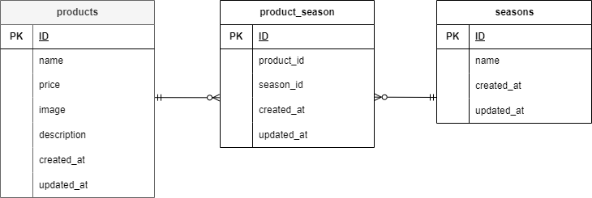

# mogitate

## 環境構築

Docker ビルド

1. git clone https://github.com/kie-okamoto/mogitate.git
2. DockerDesktop アプリを立ち上げる
3. docker-compose up -d --build

Laravel 環境構築

1. docker-compose exec php bash
2. composer install
3. 「.env.example」ファイルを「.env」ファイルに命名を変更。または、新しく.env ファイルを作成
4. .env に以下の環境変数を追加

```env
DB_CONNECTION=mysql
DB_HOST=mysql
DB_PORT=3306
DB_DATABASE=laravel_db
DB_USERNAME=laravel_user
DB_PASSWORD=laravel_pass
```

5. アプリケーションキーの作成  
   php artisan key:generate

6. マイグレーションの実行  
   php artisan migrate

7. シーディングの実行  
   php artisan db:seed

## 使用技術（実行環境）

- Laravel 8.83.8
- PHP 8.1.32
- MySQL 8.0.26

## ER 図



## URL

- 開発環境: http://localhost/
- phpMyAdmin: http://localhost:8080/
